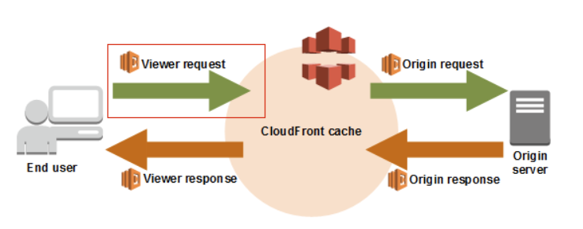

---
# try also 'default' to start simple
theme: seriph
# random image from a curated Unsplash collection by Anthony
# like them? see https://unsplash.com/collections/94734566/slidev
# background: https://cover.sli.dev
# some information about your slides, markdown enabled
title: Commit Stats AWS UG
info: |
  ## From idea to product with AWS & Python
  Created with <3
# apply any unocss classes to the current slide
class: text-center
# https://sli.dev/custom/highlighters.html
highlighter: shiki
# https://sli.dev/guide/drawing
drawings:
  persist: false
# slide transition: https://sli.dev/guide/animations#slide-transitions
transition: slide-left
# enable MDC Syntax: https://sli.dev/guide/syntax#mdc-syntax
mdc: true
hideInToc: true
---

<!-- 
- Presentation outline & Future ideas
  - SaaS (non AWS):
    - MongoDB Atlas
    - InfluxDB Cloud
  - AWS Services & Lessons learned:
    - Route53
    - Cloudfront with edge Lambda
    - API Gateway
    - Lambda
    - S3
    - KMS
    - IAM
    - ECR
  - CI+CD?
    - Pants
    - Terraform CDK
  - Python Code
    - Pants build system
    - FastUI (FastAPI)
    - GitPython
    - model-lib
  - Golang CLI
    - Most useful with Toggl
  - Development history
    - Milestones
    - Detours
    - Cors Lesson
    - Where most my time went
  - Costs
    - AWS
    - SaaS
-->

# From idea to product with AWS & Python

## Lessons learned from a two months hobby project

## AWS User Group 23rd of April

---

## Overview

<Toc minDepth="1" maxDepth="1" mode="all"></Toc>

<!-- 5 min on the demo, the rest for discussions, ask how much time we have or when people get bored -->

---

# Part 1: Commit Stats Product Demo
---
layout: two-cols
---

## About Me 1
- Geography
  - Born and raised in Kristiansand, Norway
  - Family in Stockholm, Sweden and siblings in Oslo, Norway
  - 3rd home in Ko Lanta (Kohub), Thailand
  - ~4 years in Gran Canaria
  - Resident and living with Maria in Arinaga
- Activities: Calisthenics, Weightlifting, sports++
- Career:
  - Rocketfarm (consulting, small team)
  - wheel.me (startup)
  - smidige.com (contractor)
  - MongoDB (enterprise)

::right::


<!-- 
1. Rocketfarm: Farming and developing in a Sogndal. Nice people and work life balance. But ambitious.
2. wheel.me: dev #1 -> 70 people. No work life balance but freedom to be anyware
3. Smidige: waiting on work, being blocked, but freedom
4. MongoDB: Healthy work environment with great colleagues. Quality is everything -->

---

## About Me 2
- Tech choices:
  - Python (since 3.6)
  - Terraform (~ 2 years)
  - Pycharm -> VsCode (Not worth doing the VsCode yet?)
  - Golang (Last few months)
  - MongoDB, PostgreSQL, InfluxDB, and DynamoDB
  - Kubernetess+Istio+Helm (~ 4 years)
  - Markdown <3
- Influenced by:
  - Cal Newport (productivity & life philosophy)
  - Podcasts (Latest tech news) & Books (Going deeper)
  - Tim Ferriss+Lex Friedman+ Guy Raz (Exposure to different thinkers)
  - Health: Crossfit+[ATG](https://www.atgonlinecoaching.com/) (exercise)
- More info [at my Github page](https://github.com/EspenAlbert)

<!--
1. Cal: Computer science focused on Math professor. Deep work. Slow Productivity  
2. Talk Python, Changelog, AWS Insiders, MongoDB
3. -->

---

## Problem Statement

How do you show you can code if you have only worked in private git repos?


---

## Project Background (also found at the botton of [project landing page](https://commit-stats.ealbert.org/) )


I was applying for developer jobs and I couldn't show my coding experience.
The code repositories I had been working on were in different git providers (Gitlab & Azure DevOps) and the code was **private**.

As I am a bit of a data nerd 🤓 I like to track different metrics.
Not only commits, PRs, but also LoC (Lines of Code), open source contribution, 3rd-party packages, etc.
Therefore, the two main goals of the project are:

> 1. **Support creating a "CV" page of your commit stats that you can use when applying for jobs**
> 2. **(Future) Support weekly feedback on your code and reflect on your developer journey**


I hope you will find it useful and fun 😎
Happy coding!

---

## Product Demo 1

- ["CV/Dashboard" of your commits across languages](https://commit-stats.ealbert.org/cv/EspenAlbert)


---

## Product Demo 2

- How to collect the commits:

1. Login with Github
2. Add your token


<!-- Show Add Token Page -->

---

## Product Demo 3

- Select your repos
- Full Collection Status & Open Source Repos


<!-- Add a repo here during the live demo -->

---

## Product Demo 4

- Wait...
- Updated every 15 min


---

## Product Demo 5

- Back to the beginning


---

# Part 2: Behind the scenes **discussions**

<Toc class="mt-5 ml-2" v-click minDepth="2" maxDepth="2" mode="current"></Toc>

<!-- 
Goal: Introduce different AWS services I used & lessons learned. Step through how to build this 
Emphasize: The goal is discussions
-->

---

## Architecture 😱

- [Figma](https://www.figma.com/file/sXDwzyzti2Q5TmNtpx7hmq/CommitStats?type=whiteboard&node-id=0-1)


<!-- Potential discussion points: Microservices. Event-sourcing vs API calls. -->

---
layout: two-cols
---

## Tech stack decision

- What stack would you choose?

<v-click>

- I'm a Python fan and inspired by Samuel Colvin starting the [pydantic company](https://github.com/pydantic)
  - [Pydantic Services Inc. emerges from stealth today with $4.7 million in seed funding led by Sequoia](https://techcrunch.com/2023/02/16/sequoia-backs-open-source-data-validation-framework-pydantic-to-commercialize-with-cloud-services/)
- Wanted to use [FastUI (FastAPI + React)](https://github.com/pydantic/FastUI)
  - [7.1k stars in a few months](https://star-history.com/#pydantic/FastUI&Date)
- [Highcharts](https://www.highcharts.com/docs/dashboards/dashboards-with-react)

<Transform :scale="0.50">


</Transform>


</v-click>

::right::

<v-click>

### Artifacts Produced

- classic static files
  - `index.css`
  - `index.html`
  - `index.js`
  - +++
- zip files for the lambda functions
- or a docker image

<div class="mt-8"/>

</v-click>

<v-click >

### Tech candidates

- Plotly Dash
- Your Choice?

</v-click>

<!-- Dash was slower and uglier -->

---
layout: two-cols
---

## How to deploy the artifacts? (Lambda/ECS/EC2?)

- Artifacts reminder
  - Static files (index.css|html|js ++)
  - aws zip files
  - docker images?
- What would you choose and why?

<v-click>

- I chose Lambda

<Transform :scale="0.85">


</Transform>
</v-click>

::right::


<Transform :scale="0.65">
<div class="ml-10">

<v-clicks>

- Why images? [250MB limit on Lambda functions](https://stackoverflow.com/questions/54632009/how-to-increase-the-maximum-size-of-the-aws-lambda-deployment-package-requesten)
  - Python packages 😱

  ```
  144M python3.11/site-packages//plotly
  89M python3.11/site-packages//pyarrow
  81M python3.11/site-packages//botocore
  71M python3.11/site-packages//pandas
  60M python3.11/site-packages//numpy
  42M python3.11/site-packages//dash
  ```

  - [ECR Lifecycle rules](https://eu-west-1.console.aws.amazon.com/ecr/private-registry/repositories?region=eu-west-1)

- How to choose memory size?
- How to trigger lambdas?
  - EventBridge (CloudWatch Events)
  - Supports schedule: `cron(0/15 ** *?*)` or `rate(1 minute)`
  - Specific event publishing by using `detail-type`, see `events.tf`
- Lambda cold start problem
  - [Provisioned concurrency](https://docs.aws.amazon.com/lambda/latest/dg/provisioned-concurrency.html) to the rescue? [redit thread](https://www.reddit.com/r/aws/comments/nh4nc0/aws_lambda_provisioned_concurrency_vs_keeping_a/)
  - 10 × 0.000004167 × 0.5 × 86400 = $1.80/day, or $54/month


</v-clicks>
</div>
</Transform>

<!-- 
1. Why zips? Faster packaging. No requirement on an ECR (Docker Hub instead?) 
2. Limiting costs with ECR lifecycle rule
3. Trail and error RAM size
4. Ask for cold start problem solutions
-->

---

## How do you do the routing? (Staticfiles, CDN, APIs, CORS, and SPA)

- What AWS Services?

<v-click>

<Toc class="mt-5 ml-2" v-click minDepth="3"></Toc>

</v-click>

<!-- Worth mentioning:
1. ALB/NL
2. Global Accelerator -->

---
layout: image
image: ./images/routing.png
backgroundSize: contain
---
<div class="ml-8">

### Routing Part 1: [Cloudfront](https://us-east-1.console.aws.amazon.com/cloudfront/v4/home?region=eu-west-1#/distributions)


<Transform :scale="0.65">

<v-clicks>

- [AWS WAF](https://us-east-1.console.aws.amazon.com/wafv2/homev2/start?region=us-east-1)? No
  - Minimum price of 5$ + 1$ per rule
- SSL/TLS managed by AWS
- Origins
  - HTTP -> HTTPS redirect
  - Choose caching behavior
    - `Managed-CachingOptimized`
    - `Managed-CachingDisabled`
  - Choose Response headers policy
    - `Managed-AllViewerExceptHostHeader (believe due to gateway routing)`
    - `Managed-CORS-CustomOrigin`
- Can hook into the request stages with Function associations
  - CloudFront Functions?
  - [Lambda@Edge](https://docs.aws.amazon.com/AmazonCloudFront/latest/DeveloperGuide/lambda-edge-how-it-works.html)
  - Hook points

</v-clicks>

<Transform :scale="0.65" class="ml-8">

<v-click>



</v-click>

</Transform>


</Transform>

</div>

<!-- 
1. Start by explaining the overall view
2. Talk about cloudfront (click next)
3. Can use the tools in chrome to inspect the network calls to see the hits
-->

---
layout: image
image: ./images/routing_lambda.png
backgroundSize: contain
---

<div class="ml-8">

### Routing Part 2: Lambda @ Edge

```python{all|7-10|1-3,11-13|14-|18}
ALL_S3_DOCUMENTS = set(['CodeLazy.js', 'CodeLazy.js.map', 'MarkdownLazy.js', 
'MarkdownLazy.js.map', 'index.css', 'index.html', 
'index.js', 'index.js.map'])

def lambda_handler(event, context) -> dict | None:
    """based on example: https://docs.aws.amazon.com/AmazonCloudFront/latest/DeveloperGuide/lambda-examples.html#lambda-examples-redirect-to-signin-page"""
    request: dict = event["Records"][0]["cf"]["request"]
    path = request["uri"]
    print(f"path is: {path}")
    s3_path = path.lstrip("/")
    if s3_path in ALL_S3_DOCUMENTS:
        print(f"no redirection {s3_path} exist")
        return request
    print("returning html directly")
    return {
        "status": "200",
        "statusDescription": "OK",
        "body": _html,
        "bodyEncoding": "text",
        "headers": {
            "content-type": [
                {
                    "value": "text/html;charset=UTF-8",
                }
            ]
        },
    }
```

</div>

---

### Routing Part 3: Lambda @ Edge

- inside of python script: `_html=`

```html{all|6|7-8}
<!doctype html>
<html lang="en">
  <head>
    <meta charset="UTF-8" />
    <meta name="viewport" content="width=device-width, initial-scale=1.0" />
    <title>CommitStats Landing Page</title>
    <script type="module" crossorigin src="/index.js"></script>
    <link rel="stylesheet" crossorigin href="/index.css">
  </head>
  <body>
    <div id="root" class="highcharts-light"></div>
  </body>
</html>
```

<!-- Maybe someone knows better about crossorigin attribute? -->
---

### Routing Part 4: API Gateway

- [AWS API Gateway](https://eu-west-1.console.aws.amazon.com/apigateway/main/develop/routes?api=gjwn13z2g8&integration=rnf8hmg&region=eu-west-1&routes=qls5ftn)
- Anyone experience with multiple stages?
---

### Routing Part 5: Lessons Learned

<v-clicks>

- Tip: Avoid splitting up APIs if you can
  - Fell on my face quite hard
    - CORS (Cross Origin Resource Sharing)
      - Where to add the headers?
      - Do one thing at a time
- Tip: Invalidating cache
  - Anyone knows how to do it with Terraform?

</v-clicks>

---

## SaaS products?

<v-clicks>

### Database?

1. [MongoDB Atlas with Free Forever (up to 512MB)](https://www.mongodb.com/pricing)
   1. Use AWS KMS to encrypt the tokens
2. [InfluxDB Cloud Serverless ($250 in free credits for 90 days)](https://www.influxdata.com/influxdb-pricing/)
3. Alternatives
   1. Elasticsearch
   2. RDS (PostgreSQL)
   3. DynamoDB
   4. DocumentDB?

### Message Queue alternatives?

1. EventBridge
2. [Kafka (Confluence)](https://www.confluent.io/cloud-kafka)
3. Redis?
4. [RabbitMQ](https://www.cloudamqp.com/)

</v-clicks>

---

## AWS Organization?

- Would you use than more than one AWS account?

<v-click>

- Root account
  - Route53
  - IAM Config
  - ECR
- `{Project Name}` Account: CommitStats
  - Billing separate
  - Need access to route53 to add DNS records (Terraform and `assume_role` to the rescue)
- Terraform Basic Needs
  - S3 with replication
  - KMS (Optional -> can be costly)

</v-click>

<!-- Out of scope to talk about a professional company -->

---

## Cost of the solution?

<v-clicks>

- Which AWS service do you think is the most expensive?
- KMS
  - Stopped encrypting terraform state to save money
- [Cost Explorer](https://us-east-1.console.aws.amazon.com/costmanagement/home?region=eu-west-1#/cost-explorer?chartStyle=STACK&costAggregate=unBlendedCost&endDate=2024-03-31&excludeForecasting=false&filter=%5B%5D&futureRelativeRange=CUSTOM&granularity=Monthly&groupBy=%5B%22Service%22%5D&historicalRelativeRange=LAST_6_MONTHS&isDefault=true&reportName=New%20cost%20and%20usage%20report&showOnlyUncategorized=false&showOnlyUntagged=false&startDate=2023-10-01&usageAggregate=undefined&useNormalizedUnits=false)
- InfluxDB, most costly for now ($2.49 for February)
  - Data out $0.17 for 1.88GB
  - Data In $1.59 for 635.851 MB
  - Query count $0.64 for 5342 queries (0.012 per 100 query executions)
  - Storage:$0.09 for 43.461 GB-hr

</v-clicks>

<!-- Mention story about being a student, pushing credentials, and having a 20k bill over night -->

---

## Multiple environments? CI workflows?

- What if you need to host stage/QA environments?
  - Recreate the full terraform with a new environment or re-use infrastructure
- lambda versioning? aliases?
- Time for a live deployment?

---

## Quality checks & Local testing

- Time for a demo?

---


## Future of the Project

- Alternative to InfluxDB for hosting
- Improved on-boarding experience
- [More in the `Future ideas` section](https://commit-stats.ealbert.org/)

---

# Questions?

- Observability tools?
  - Sentry?
  - OTEL - Open Telemetry
  - ELK (Elasticsearch, Logstash, Kibana)
  - Cloudwatch


---

# Thank You

- AWS User Group organizers
  - Andrey
  - Antonio
  - Andras
- Leo for hosting us
- Everyone for joining
- [slidev](https://github.com/slidevjs/slidev)
